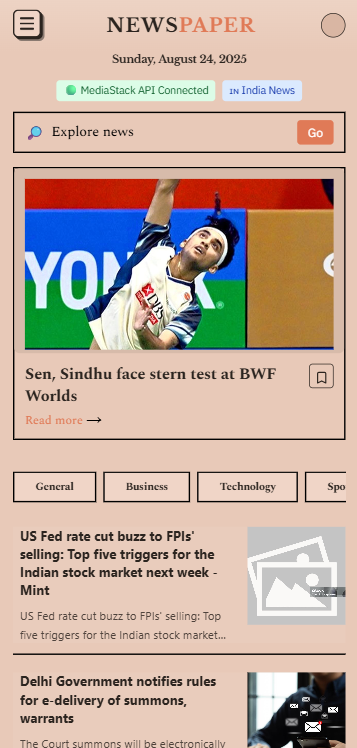
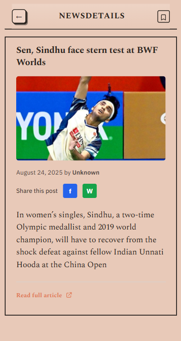

# 📰 NewsPaper - Modern News Aggregator

A beautiful, responsive news aggregator built with React and Vite that fetches real-time news from MediaStack API. Features a vintage newspaper design with modern functionality.

  

## 📸 Screenshots

<div align="center">
  
  
</div>

## ✨ Features

- 🌍 **Global & Local News**: Switch between world news and India-specific news
- 📱 **Responsive Design**: Beautiful vintage newspaper aesthetic that works on all devices
- 🔍 **Search Functionality**: Search for specific topics and keywords
- 📂 **Category Filtering**: Browse news by categories (General, Business, Technology, Sports, etc.)
- 🔖 **Bookmark System**: Save your favorite articles for later reading
- 📖 **Article Details**: Read full article descriptions with external links
- 🔗 **Social Sharing**: Share articles on Facebook and WhatsApp
- 🎨 **Vintage UI**: Unique newspaper-style design with custom fonts and styling

## 🚀 Live Demo

[View Live Demo](https://your-demo-link.com) _(Add your deployed link here)_

## 🛠️ Tech Stack

- **Frontend**: React 18.2.0
- **Build Tool**: Vite 5.0.0
- **Styling**: Tailwind CSS 3.3.0
- **API**: MediaStack News API
- **Icons**: Heroicons (SVG)
- **Fonts**: Custom font stack (Libre Baskerville, IBM Plex Sans, etc.)

## 📋 Prerequisites

Before running this project, make sure you have:

- **Node.js** (version 16 or higher)
- **npm** or **yarn** package manager
- **MediaStack API Key** (free tier available)

## 🔧 Installation & Setup

### 1. Clone the Repository

```bash
git clone https://github.com/your-username/news-app.git
cd news-app
```

### 2. Install Dependencies

```bash
npm install
# or
yarn install
```

### 3. Environment Configuration

Create a `.env` file in the root directory:

```env
VITE_MEDIASTACK_API_KEY=your_mediastack_api_key_here
```

#### Getting MediaStack API Key:

1. Visit [MediaStack](https://mediastack.com/)
2. Sign up for a free account
3. Get your API key from the dashboard
4. Free tier includes 500 requests/month

### 4. Run the Development Server

```bash
npm run dev
# or
yarn dev
```

Open [http://localhost:5173](http://localhost:5173) to view it in the browser.

## 🎯 How to Use

### Navigation

- **Hamburger Menu** (top-left): Switch between World and India news
- **Search Bar**: Search for specific topics or keywords
- **Category Pills**: Filter news by categories
- **Article Cards**: Click to read full article details

### Features

- **Bookmark Articles**: Click the bookmark icon to save articles
- **Share Articles**: Use Facebook or WhatsApp sharing buttons
- **Read Full Article**: Click "Read full article" to visit the original source

## 📁 Project Structure

```
news-app/
├── public/
├── src/
│   ├── App.jsx              # Main application component
│   ├── detail.jsx           # Article detail page
│   ├── mockData.js          # Mock data for demo mode
│   └── main.jsx             # Application entry point
├── index.html
├── package.json
├── tailwind.config.js
├── vite.config.js
└── README.md
```

## 🎨 Design Features

### Vintage Newspaper Aesthetic

- **Custom Color Palette**: Warm paper tones and vintage colors
- **Typography**: Serif fonts for headlines, sans-serif for body text
- **3D Button Effects**: Pressed button animations
- **Borders & Shadows**: Newspaper-style borders and shadows

### Responsive Layout

- **Mobile-First**: Optimized for mobile devices
- **Grid System**: Flexible article grid layout
- **Image Handling**: Proper aspect ratios and fallbacks

## 🔌 API Integration

### MediaStack API

- **Endpoint**: `https://api.mediastack.com/v1/news`
- **Features**:
  - Global news from 7,500+ sources
  - Real-time updates
  - Category and country filtering
  - Image and metadata support

### API Parameters

- `access_key`: Your MediaStack API key
- `countries`: Country code (e.g., 'in' for India)
- `categories`: News category
- `limit`: Number of articles (max 100)
- `language`: Language filter

## 🚀 Deployment

### Vercel (Recommended)

1. Install Vercel CLI:

```bash
npm i -g vercel
```

2. Deploy:

```bash
vercel
```

### Netlify

1. Build the project:

```bash
npm run build
```

2. Deploy the `dist` folder to Netlify

### GitHub Pages

1. Add to `package.json`:

```json
{
  "homepage": "https://your-username.github.io/news-app",
  "scripts": {
    "predeploy": "npm run build",
    "deploy": "gh-pages -d dist"
  }
}
```

2. Deploy:

```bash
npm run deploy
```

## 🔧 Available Scripts

- `npm run dev` - Start development server
- `npm run build` - Build for production
- `npm run preview` - Preview production build
- `npm run lint` - Run ESLint

## 🤝 Contributing

1. Fork the repository
2. Create your feature branch (`git checkout -b feature/AmazingFeature`)
3. Commit your changes (`git commit -m 'Add some AmazingFeature'`)
4. Push to the branch (`git push origin feature/AmazingFeature`)
5. Open a Pull Request

## 📝 License

This project is licensed under the MIT License - see the [LICENSE](LICENSE) file for details.

## 🙏 Acknowledgments

- **MediaStack** for providing the news API
- **Tailwind CSS** for the utility-first CSS framework
- **Vite** for the fast build tool
- **React** for the amazing frontend library

## 📞 Support

If you have any questions or need help:

- Create an issue in this repository
- Email: your-email@example.com
- Twitter: [@your-handle](https://twitter.com/your-handle)

## 🔄 Changelog

### Version 1.0.0

- Initial release
- MediaStack API integration
- Responsive design
- Bookmark functionality
- Social sharing
- Category filtering

---

⭐ **Star this repository if you found it helpful!**
